# 原读（OrigRead）

<div align="center">
  <a href="README.md">English</a> |
  <a href="README-zh-CN.md">简体中文</a>
</div>

<div align="center">
  
</div>

<div align="center">
  <strong>一个以“来源优先”为核心的 Android RSS 阅读器、Feed 阅读器、新闻阅读器与个人信息阅读器。</strong>
</div>

<div align="center">
  RSS / Atom · RSSHub · 网页解析 · JSON/API · 全文提取 · 翻译 · AI 摘要 · OPML
</div>
<div align="center">
  
  
  <a href="LICENSE"></a>
  
  
  
</div>


## 原读是什么？

原读是一款面向 Android 的个人信息阅读器。它不把“推荐算法”作为核心，而是希望让用户自己决定**看什么来源、按什么方式解析、哪些内容需要过滤、什么时候需要翻译或 AI**。

在传统 RSS / Atom 之外，原读还把来源范围扩展到了 RSSHub、普通网页、JSON/API、WordPress REST、Next.js / Nuxt 内嵌数据，以及必要时的动态 WebView 页面。

原读的目标很直接：**订阅来源、保留原文、尽可能提取可读正文、本地过滤噪音，并把翻译和 AI 作为可选的阅读辅助，而不是让 AI 反过来成为阅读器本身。**

## 我该下载普通版还是原读 X？

原读现在提供两个 Android 版本。**两者的订阅、阅读、全文提取、过滤、翻译和 AI 摘要等基础体验是一致的；原读 X 是在这些能力上继续增加更完整的 AI 阅读助手。**

| 版本 | 适合谁 | APK 文件名 |
| --- | --- | --- |
| **原读（OrigRead）** | 主要想订阅、读文章、提取全文、过滤内容、翻译或生成摘要，希望功能直接、配置更少 | `OrigRead-vX.Y.Z.apk` |
| **原读 X（OrigRead X）** | 除了上面的功能，还想围绕文章继续提问、组合多篇文章、联网搜索、使用 MCP 工具、Skills 和快捷消息 | `OrigRead-X-vX.Y.Z.apk` |

如果你拿不准，**先装普通版就行**。以后想用 X 的功能，可以直接再安装原读 X，不需要先卸载普通版。

普通版和 X 版使用不同的应用包名，因此可以在同一台手机上同时安装。两边可以通过版本间同步迁移共同的数据和设置；X 独有的配置不会因为同步到普通版就把普通版变成 X，也不会被普通版无故清掉。

> 注意：较早的历史 Release 可能只有普通版 APK，因为当时还没有发布 X 包。下载时请直接看 Release 里的文件名，不要把普通版 APK 改名当成 X 版。

## 为什么做原读？

- **来源优先，而不是推荐优先**：信息流由用户自己的订阅组成，文章始终保留原始来源链接。
- **不只有 RSS**：RSS/Atom、RSSHub、HTML 网页规则、自动 DOM 识别、JSON/API、WordPress REST、Next.js/Nuxt 以及动态页面都可以进入来源发现链路。
- **日常解析不依赖 AI**：来源发现、候选评分、正文提取和过滤都优先使用本地确定性逻辑。
- **AI 只是阅读工具**：AI 用于文章摘要、AI 全文翻译和辅助生成解析规则，不把 App 做成聊天客户端；生成的规则必须先通过本地验证并由用户明确确认保存。
- **新文章入库前过滤**：全局或来源级关键词/正则规则可以在文章写入本地数据库前直接拦截噪音。
- **全文阅读始终保留退路**：网站规则、Readability、结构化数据和 WebView 共同尝试提取正文，失败时仍可一键阅读原文。
- **配置可以迁移**：订阅、分组、解析规则、过滤规则、RSSHub、翻译和 AI 配置都可以统一备份并跨设备恢复。

## 软件截图

<p align="center">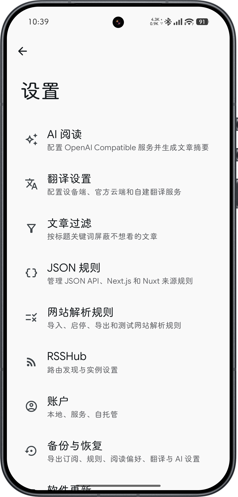</p>

| 来源发现 | 阅读与全文 | AI 摘要 |
| --- | --- | --- |
| 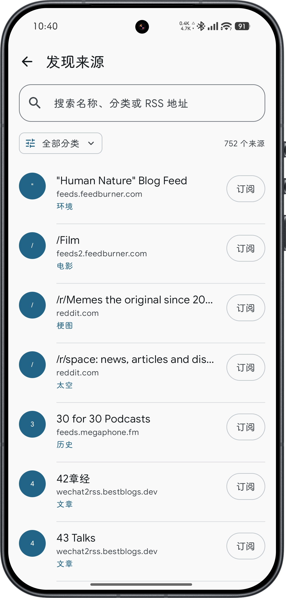 | 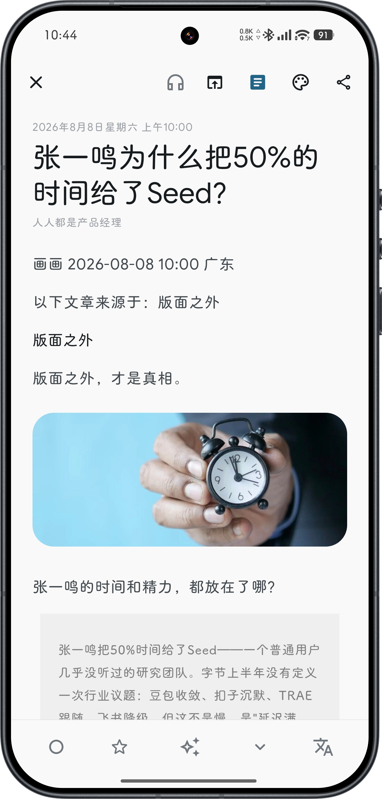 | 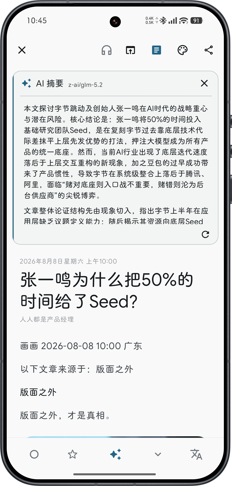 |

| 翻译 | 解析规则 | 设置与备份 |
| --- | --- | --- |
| 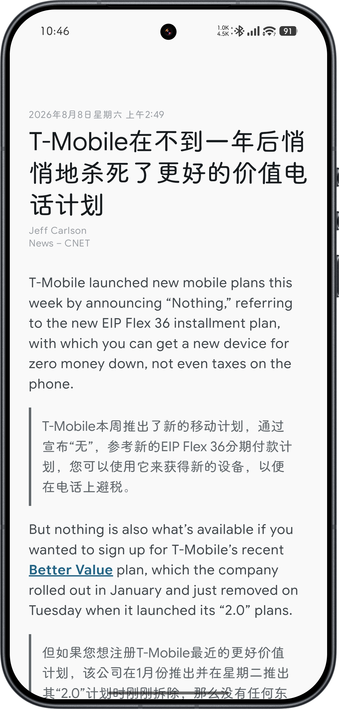 | 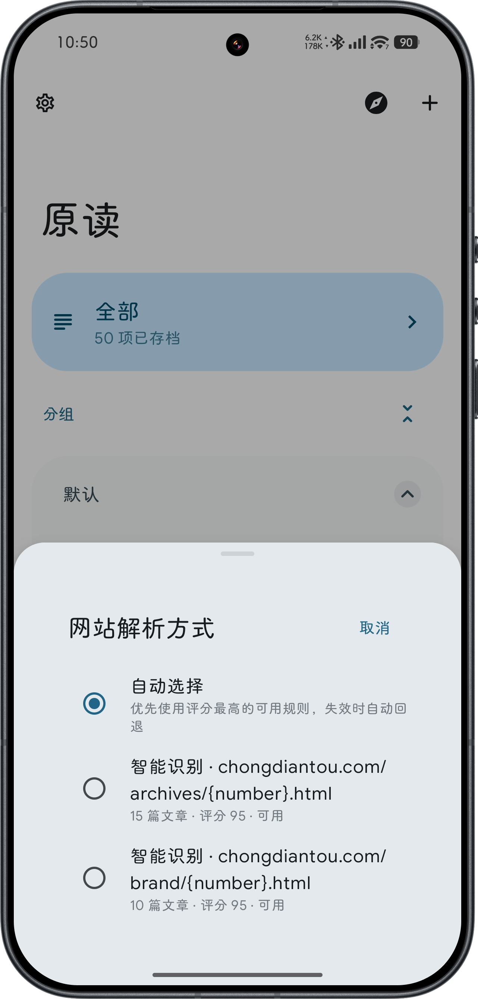 | 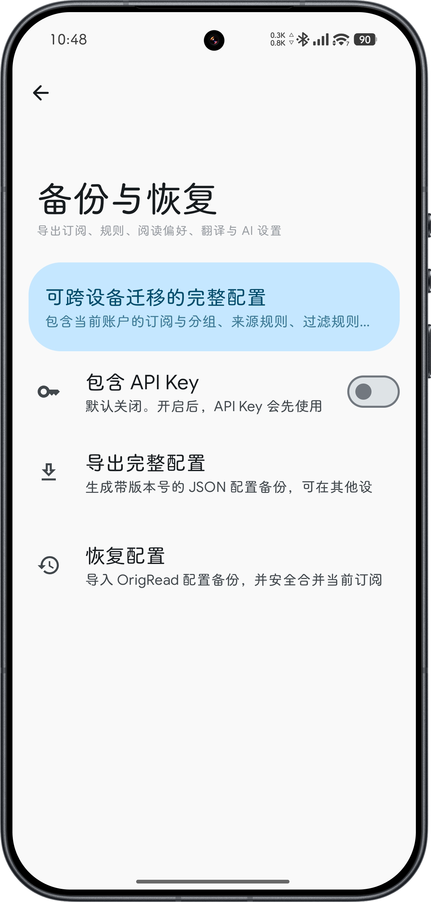 |

### 原读 X

| AI 阅读助手 | 多文章与回答上下文 |
| --- | --- |
| 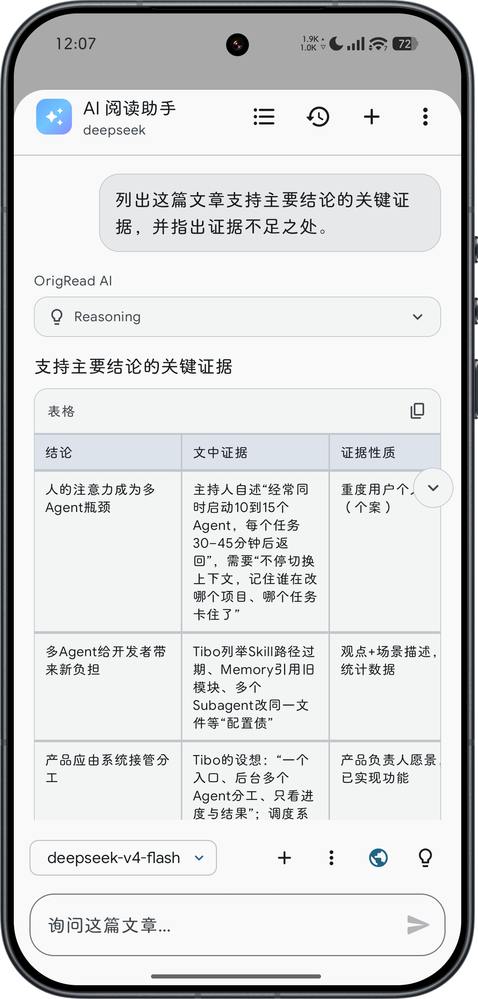 | 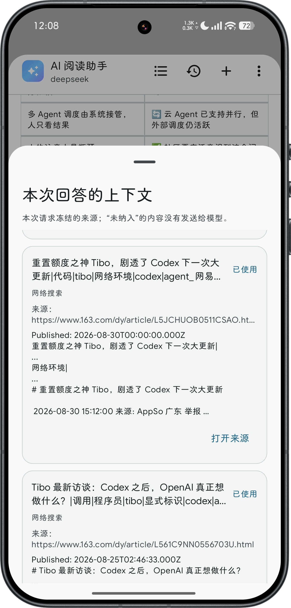 |

| Web Search | X 版 AI 设置 |
| --- | --- |
| 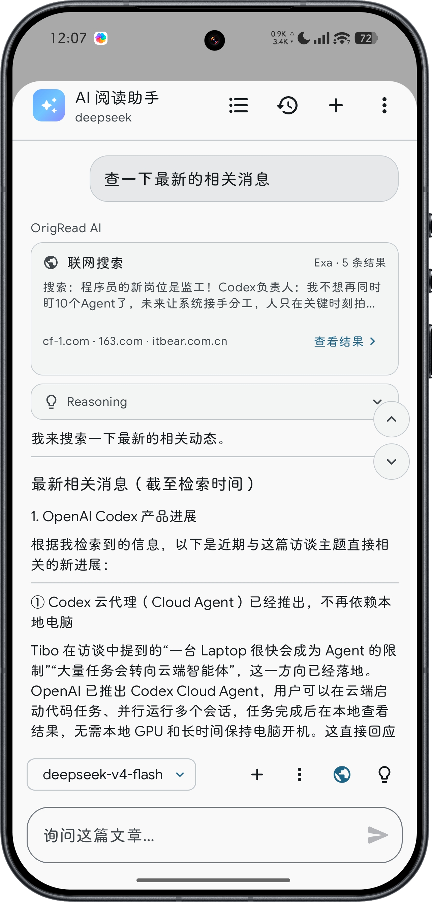 | 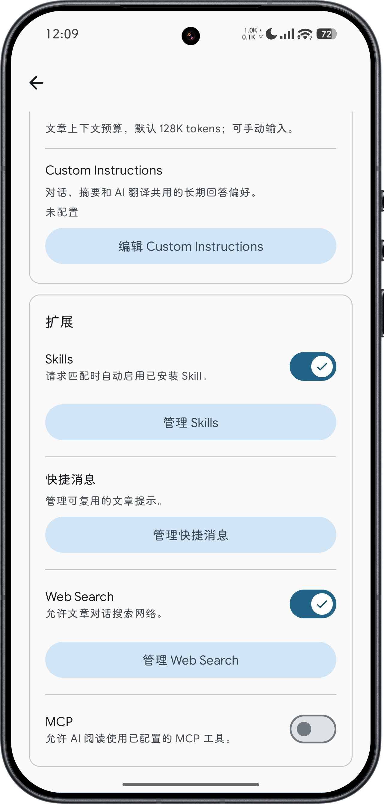 |

## 文档与其他平台

| 📖 Android 操作手册 | 🖥️ Desktop 版本 |
| --- | --- |
| [查看 Android 操作手册](USER_GUIDE-zh-CN.md)，普通版和原读 X 共用一份手册；X 独有功能已经单独分节，不使用 X 的用户可以直接跳过。 | [前往 OrigRead Desktop](https://github.com/ZGMFX01A/OrigRead-Desktop)，支持 Windows、macOS 与 Linux。 |

## 来源发现：一个 URL，多种解析路径

原读不会假设所有网站都提供相同类型的数据源。添加一个网址时，可以同时尝试多种解析方式，最后对有效候选做本地健康检查和评分。

```text
输入 URL
  ↓
直接 RSS / Atom
  ↓
网页 rel=alternate + 常见 Feed 地址探测
  ↓
RSSHub 路由匹配
  ↓
JSON / API / WordPress / Next.js / Nuxt
  ↓
网站解析规则
  ↓
自动重复 DOM 列表识别
  ↓
动态页面受限 WebView 兜底
  ↓
本地健康检查 + 候选评分
  ↓
默认推荐最佳候选，也允许用户手动选择
```

### RSS / Atom 与内置来源发现

- 直接订阅 RSS 和 Atom。
- 自动识别网页中的 `<link rel="alternate">` Feed。
- 自动尝试 `/feed`、`/rss`、`/rss.xml`、`/atom.xml`、`/feed.xml`、`/index.xml` 等常见地址。
- 内置由 **awesome-rss-feeds** 与 **BestBlogs** 生成的来源发现目录，包含 700+ 个去重 Feed，并支持多语言分类浏览和搜索。
- 支持 OPML 导入与导出，方便从其他 RSS 阅读器迁移。

### RSSHub：只消费现成路由，不把 RSSHub 服务端塞进 APK

原读把 RSSHub 定位为一个可选的“路由与结果层”，而不是在 Android 内运行一套 RSSHub 服务。

- APK 内置 5,000+ 条构建时生成的静态/动态 RSSHub 路由定义，用于本地匹配。
- 对支持的动态路由，可以从 URL 路径和查询参数中提取参数。
- 支持配置多个 RSSHub 实例，并单独启用、停用和测试。
- 最近成功实例优先；失败实例会进入短暂冷却，避免连续等待。
- RSSHub 连接失败不会阻断添加来源，原读会继续尝试 RSS、JSON/API 或网页解析。
- App 不需要 Redis、Puppeteer、browserless，也不要求本地运行 RSSHub Server。

### 网站解析规则与自动 DOM 识别

对于没有可用 Feed 的网站，原读可以把按时间排列的文章列表转换为可订阅来源。

- 基于 Jsoup CSS Selector 的 **HTML / WebsiteRule 网站解析规则**。
- 同一域名可以存在多条规则并作为候选竞争。
- 没有现成规则时，可以自动识别重复 DOM 结构中的文章卡片。
- 候选评分会检查文章数量、标题/链接有效率、链接唯一率、时间质量和有限的来源可信度。
- 用户选择的解析方式会按来源持久化，后续刷新优先复用。
- 网站规则支持导入、导出、启停、删除、测试，以及应用内完整 Markdown 使用说明。
- 解析算法或规则失效不会自动删除已经保存的历史文章。

### JSON/API、WordPress、Next.js 与 Nuxt

原读也支持并非传统 Feed 的结构化数据源。

- 独立 JSON/API 解析规则和受限 JSONPath。
- 普通公开 REST/JSON 列表和嵌套数组。
- WordPress REST API 自动发现，兼容 WordPress 安装在子目录的情况。
- 解析网页内嵌的 `__NEXT_DATA__`、`__NUXT_DATA__` 与 Nuxt 数据。
- 支持相对 URL、秒/毫秒时间戳、常见字符串时间，以及可选作者、摘要、图片和 ID 字段。
- JSON/API 结果与 RSS、RSSHub、网页规则共用候选健康检查与评分体系。

### 动态页面 WebView 兜底

静态解析始终优先。只有普通 RSS / JSON / HTML 路径都无法得到健康结果时，才启用 WebView 作为兜底。

- 限定同站/相关域名导航。
- 不暴露危险的 JavaScript 原生桥接。
- 有明确的加载预算和销毁流程。
- 动态文章列表仍复用网站解析器与候选评分。
- 动态正文仍复用统一全文提取链路。
- 后台批量全文预取不会自动启动需要人工交互的验证页面。

原读**不会尝试绕过登录、验证码、付费墙或网站访问控制**。

## 全文提取与阅读原文

原读不是只依赖一种正文算法，而是把多种候选放到统一全文提取流程中：

- 网站规则明确配置的 `contentSelectors` 优先。
- Readability 风格的通用正文提取。
- JSON-LD / OpenGraph 补全标题、作者、发布时间和兜底内容。
- 正文 HTML 清理、危险节点移除和相对链接/图片 URL 补全。
- 多正文候选之间进行本地质量评分。
- JavaScript 动态正文可以进入受限 WebView 兜底。
- 失败时返回稳定的失败原因，并始终保留 **阅读原文**。

## 基础阅读能力

- 已读 / 未读。
- 收藏（Starred）。
- 归档与文章保留周期。
- 来源分组与文章搜索。
- RSS 摘要 / 全文阅读。
- 一键打开原始网页。
- TTS 朗读。
- Material You / Jetpack Compose 界面。
- 本地账户，以及可选的第三方同步方式。

## 本地文章过滤

过滤发生在新文章写入数据库之前。

- 全局标题关键词过滤。
- 来源级标题过滤。
- 正则表达式规则，并在保存前验证表达式合法性。
- 规则启停、删除。
- 独立 JSON 导入与导出。
- 累计过滤数量统计。

新建过滤规则后，原读不会反向删除已经入库的历史文章，避免错误规则造成不可逆的数据损失。

## 翻译：传统翻译与 AI 可以独立使用

翻译功能并不依赖 AI 摘要。即使完全不配置 LLM，也可以使用传统翻译 Provider。

### 传统翻译 Provider

- Google ML Kit 设备端翻译。
- Microsoft Translator。
- DeepL。
- Google Cloud Translation。
- 用户自建 DeepLX / DLX 兼容接口。

阅读页支持标题与正文翻译、仅译文显示、双语分段对照、内容哈希缓存、Provider 选择以及长文章分批处理。

## 把文章分享到笔记软件

在文章阅读页点击 **分享**，现在可以分享的不只是链接，原文 URL 始终会保留。第一次使用时，可以选择要发送的内容：文章标题、原文正文、当前阅读页已经打开的翻译，以及当前阅读页已经打开的摘要。保存后短按分享会直接使用这套选择；以后长按分享按钮可以重新修改。

原读会优先发送富文本 HTML；不支持 HTML 的应用会收到带样式文本或纯文本回退。文章里的图片仍以外链地址保留，不会把图片文件本身复制过去。即使历史上生成过摘要或翻译，只要当前阅读页没有打开，就不会被分享。列表页的原有分享方式不变。

### AI 全文翻译

OpenAI Compatible 模型也可以作为统一翻译目标。

- 支持多个 AI 供应商和多个模型。
- 使用严格翻译 Prompt，禁止总结、解释、扩写、删减或改变作者立场。
- 长文章自动分块并按预算分批请求。
- 为文本块分配稳定 ID，本地校验模型结果，避免模型偷偷合并、拆分或打乱正文段落。
- HTML 结构由本地代码重建，模型只负责翻译文本，不负责重新生成页面结构。

## AI 阅读辅助

AI 是完全可选能力，只有用户配置并主动使用时才会调用。

### 多 OpenAI Compatible 服务

每个 AI 服务都可以独立配置：

- 服务名称。
- Base URL 或完整 Chat Completions 地址。
- 可选 API Key。
- 自动获取或手动填写的模型列表。
- 默认模型。
- 启停和连接测试。

因此原读可以连接多种 OpenAI Compatible 云服务、自建网关和本地模型服务，而不会绑定某一家模型厂商。

### AI 文章摘要

- 一句话、标准、详细三档摘要。
- 阅读页原生 Markdown 渲染。
- 基于正文内容哈希的摘要缓存。
- 显示“整理文章 / 等待模型 / 整理摘要”等生成阶段和已等待时间，非流式请求期间也不会让用户误以为 App 卡死。
- 重新生成时可以临时选择供应商、模型和摘要档位，不修改全局默认配置。
- 摘要面板只是正文旁边的辅助区域，不会把阅读页变成 AI 对话界面。

### AI 辅助生成解析规则

AI 辅助 WebsiteRule / JsonRule 生成已经接入确认式流程：抓取目标地址后可选择已配置的 Provider 和模型，由模型生成候选，再使用现有本地解析器和健康检查真实试跑，只有用户明确确认后才保存。过程中会显示抓取、分析、生成、校验和修复阶段，并展示解析文章数、评分、实际模型与尝试次数；网站结构变化后仍应重新测试规则。

## 原读 X：把 AI 放在文章旁边，而不是另外做一个聊天软件

原读 X 包含普通版的全部阅读能力，区别主要在于：**读完一篇文章后，你还可以继续围绕这篇文章追问、查资料和组合上下文。**

- **询问当前文章**：从阅读页直接进入 AI 阅读助手，问题默认围绕当前文章，而不是从空白聊天开始。
- **选中文字直接问**：正文里选中一句或一段后，可以把这段内容直接带进阅读助手。
- **一次带上多篇文章**：需要对比报道或补充背景时，可以手动附加相关文章；只有你明确选中的文章才会进入上下文。
- **Web Search**：问题涉及“最新、今天、近期、当前进展”等信息时，可以自动或手动联网搜索，并查看实际搜索过程和结果。
- **MCP 工具**：可以连接自己配置的 MCP Server。敏感或写入型 Tool 在执行前需要明确确认。
- **Skills、快捷消息和 Custom Instructions**：把常用分析方式、固定问题和长期回答偏好保存下来，不必每次重新输入。
- **流式输出、Reasoning 与 Context Budget**：适配更复杂的模型和长文章场景；正常使用保持默认设置即可。

这些功能都不是使用原读 X 的前置条件。**如果你只想使用 X 版的界面和普通阅读功能，也不需要把 Web Search、MCP、Skills 全部配置一遍。**

具体怎么打开阅读助手、添加多篇文章、配置 Web Search / MCP / Skills，请看 [Android 操作手册第二部分“原读 X”](USER_GUIDE-zh-CN.md#origread-x-guide)。

## 完整配置备份与恢复

原读使用带版本号的 JSON 配置备份，而不是直接复制 Room 数据库或系统偏好文件。

可以迁移：

- 当前账户的订阅与分组。
- 同步行为设置。
- 网站解析规则和 JSON/API 规则。
- 文章过滤规则。
- 来源级网页解析偏好。
- RSSHub 实例、设置及来源映射。
- 翻译 Provider 与翻译设置。
- AI Provider、模型列表和默认设置。
- 普通用户偏好，包括是否启动时检查更新。

恢复订阅采用 URL 安全合并：目标设备已有来源复用，缺失来源新增，目标设备额外存在的订阅不会被删除，因此不会因为“恢复配置”误删现有文章。

API Key **默认不进入备份**。只有用户主动开启“包含 API Key”并设置备份密码时，才会使用 PBKDF2-HMAC-SHA256 派生密钥，再以 AES-256-GCM 加密凭据块。该密文不复用设备绑定的 Android Keystore 密文，因此可以在另一台设备输入相同备份密码后恢复。

文章正文、已读/收藏状态、AI 摘要缓存、翻译缓存、正文缓存和临时更新状态不属于“用户配置”，不会进入配置备份。

## 软件更新

GitHub 渠道支持通过 GitHub Releases 在应用内检查和安装新版本。

- “启动时检查更新”可独立开关。
- 支持手动“立即检查更新”。
- 展示 Release 更新日志，并按当前版本自动选择普通版或 X 版对应的 APK Asset。
- 下载进度、失败重试和系统安装流程。
- Android 8+ 的“安装未知应用”通过系统设置页正常授权。

## 安全与隐私设计

- 常规 RSS / 网页解析与候选评分都使用本地确定性逻辑。
- AI 完全可选，只有用户主动调用 AI 功能时才会向已配置服务发送当前文章内容。
- 云翻译完全可选；支持 ML Kit 设备端翻译。
- 云端 API Key 使用 Android Keystore 保护。
- 配置备份默认不导出 API Key，只有用户主动开启并设置密码后才加密迁移。
- WebView 解析不向网页暴露高权限 JavaScript → Android 桥接。
- 不绕过登录、验证码、付费墙和访问控制。

## 安装

从 [GitHub Releases](https://github.com/ZGMFX01A/OrigRead/releases) 下载 APK：

- 普通版选择 `OrigRead-vX.Y.Z.apk`。
- 原读 X 选择 `OrigRead-X-vX.Y.Z.apk`。

如果某个历史版本只看到 `OrigRead-vX.Y.Z.apk`，说明那个版本当时没有发布 X 包，不是下载页面漏掉了文件。

不知道选哪个时，建议先装普通版；之后可以把 X 版直接装在同一台手机上，再使用应用内的版本间同步迁移共同数据。

当前 GitHub Release 构建目标：

- Android 8.0 / API 26 及以上。
- `arm64-v8a` 设备。

## 从源码构建

环境要求：

- Android Studio 与项目需要的 Android SDK。
- JDK 17。

Windows：

```powershell
.\gradlew.bat assembleGithubRelease
```

Linux / macOS：

```bash
./gradlew assembleGithubRelease
```

GitHub 自更新依赖只存在于 GitHub flavor；F-Droid / Google Play flavor 使用独立的商店渠道安全实现，不会把自更新权限带入商店包。

## 项目来源、致谢与许可证

原读是基于 [Read You](https://github.com/ReadYouApp/ReadYou) 的二次开发项目。

Read You 提供了项目最初的重要基础，包括大量 Compose UI、RSS 阅读器架构、本地化体系和已有阅读能力。原读在此基础上继续增加多来源发现、网页解析规则、JSON/API 来源、RSSHub、动态页面兜底、统一正文提取、文章过滤、传统/AI 翻译、AI 摘要、AI 规则生成、完整配置备份和 GitHub 在线更新等能力。

感谢 Read You 原作者及所有贡献者提供的开源基础。

本项目继续遵循 **GNU General Public License v3.0（GPL-3.0）**，详见 [`LICENSE`](LICENSE)。任何修改和衍生版本都应继续遵守 GPLv3 的相关要求。

## 相关链接

- 项目仓库：https://github.com/ZGMFX01A/OrigRead
- 版本发布：https://github.com/ZGMFX01A/OrigRead/releases
- 问题反馈：https://github.com/ZGMFX01A/OrigRead/issues
- 桌面版本：https://github.com/ZGMFX01A/OrigRead-Desktop
- 操作手册：[简体中文](USER_GUIDE-zh-CN.md) · [English](USER_GUIDE.md)
- Read You 原项目：https://github.com/ReadYouApp/ReadYou

## 搜索关键词

Android RSS 阅读器、RSS 阅读器、Atom 阅读器、Feed 阅读器、Android 新闻阅读器、个人信息阅读器、RSSHub 客户端、RSSHub Android、RSS 来源发现、RSS 订阅、OPML、全文 RSS、全文提取、Readability、网页解析、网站解析规则、HTML Parser、CSS Selector、JSON API 阅读器、JSONPath、WordPress REST、Next.js、Nuxt、WebView 动态解析、文章过滤、关键词过滤、正则过滤、AI 摘要、文章摘要、AI 翻译、OpenAI Compatible、DeepL、DeepLX、Google ML Kit 翻译、Material You、Jetpack Compose、Kotlin。

## Star 历史

[](https://www.star-history.com/?repos=ZGMFX01A%2FOrigRead&type=timeline&logscale=&legend=top-left)
