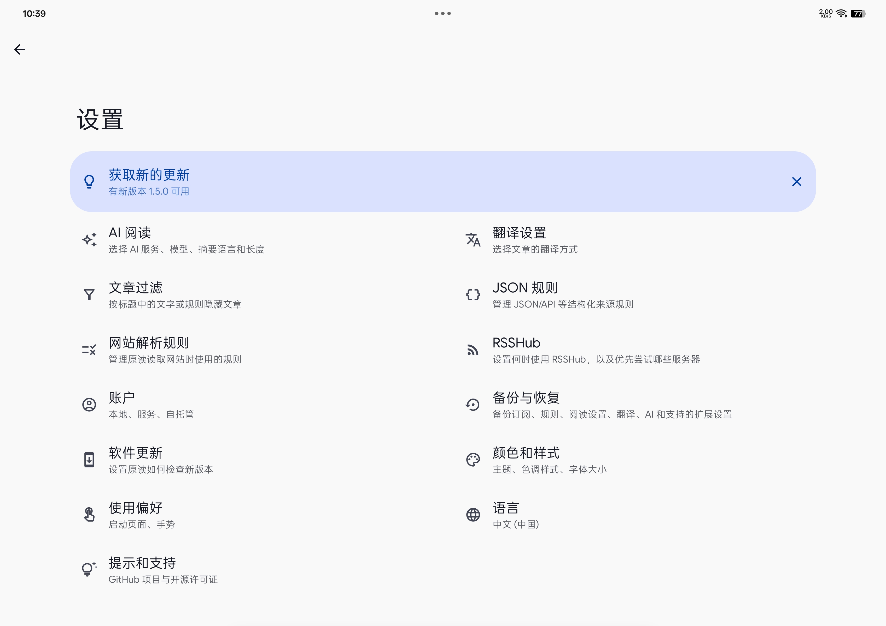

<div align="center">
  
  <h1>原读 · OrigRead</h1>
  <p><strong>读你关心的，回到信息的出处。</strong></p>
  <p>Android RSS 阅读器，让订阅、全文阅读与 AI 辅助自然地连在一起。</p>
  <p><a href="README.md">English</a> · 简体中文</p>
  <p>
    <a href="https://github.com/ZGMFX01A/OrigRead/releases/latest"></a>
    
    <a href="LICENSE"></a>
    
    <a href="https://github.com/ZGMFX01A/OrigRead/stargazers"></a>
  </p>
  <p>
    <a href="https://github.com/ZGMFX01A/OrigRead/releases/latest"><strong>下载 Android 版</strong></a> ·
    <a href="USER_GUIDE-zh-CN.md">操作手册</a> ·
    <a href="https://github.com/ZGMFX01A/OrigRead-Desktop">桌面版</a> ·
    <a href="https://github.com/ZGMFX01A/OrigRead/issues">反馈问题</a>
  </p>
</div>

## 把值得读的，放在一起

喜欢的博客、持续关注的新闻、偶尔更新的专栏，都可以有一个固定的阅读去处。原读把你选择的来源汇成时间线，让你按自己的兴趣和节奏阅读。

从订阅一个网址开始，打开文章，读全文；遇到外语就对照译文，遇到疑问就带着文章问 AI。需要核实回答时，点一下引用，便能回到它所依据的文字。**从发现内容到理解内容，原文始终在手边。**

<table>
  <tr>
    <th width="33%">发现想读的来源</th>
    <th width="33%">安静地读一篇文章</th>
    <th width="33%">带着疑问继续读</th>
  </tr>
  <tr>
    <td align="center"></td>
    <td align="center"></td>
    <td align="center"></td>
  </tr>
</table>

## Citation：让回答有出处，也让出处找得回

读到 AI 给出的结论，你可能还想确认：作者真的这么说了吗？这句话在什么语境里？两篇报道的依据是否相同？Citation 把回答和文章中的证据连起来，让这些问题可以随手核对。

**从回答，找到原文。** 回答引用文章时，会带上 `[1]`、`[2]` 这样的标记。点开文章引用，原读会定位并高亮对应的正文，让你连同前后文一起读。如果依据来自另一篇附加文章，也能切过去查看；一处引用涉及多个来源时，可以展开选择要核对的出处。

**看过原文，接着读回答。** 正文中的引用标记也能点。它会带你回到产生这条引用的那次对话、那条回答，并定位到相应段落。即使刚才跳去了另一篇文章，也不用重新翻聊天记录找读到哪儿了。

比如，把两篇关于同一件事的报道交给 AI，问一句“它们在哪些地方说法不同？”你可以沿着回答中的引用逐一查看两边的原话，再回到比较结果继续追问。**AI 帮你整理线索，引用让你自己判断。**

联网搜索的引用会保留网页出处，工具结果也保留各自来源。遇到文章改写、旧引用无法准确定位的情况，原读会提供来源供你查看。引用方便核对，并不意味着 AI 的理解一定正确。

详细操作见[手册中的 Citation 章节](USER_GUIDE-zh-CN.md#6-citation回答里的引用真的可以回到原文)。

## 从订阅到读懂，少一点来回折腾

### 没有 RSS，也值得订阅

喜欢的网站没有订阅按钮，不一定就得每天自己去刷。**原读会尝试把网站里持续更新的内容，变成可以追踪的订阅。** 粘贴首页或栏目页地址，它会寻找 RSS / Atom、匹配 RSSHub 路由；没有现成 Feed 时，还可以从网页文章列表或公开 JSON/API 中寻找内容。WordPress 的文章接口，以及部分 Next.js、Nuxt 网页中自带的文章数据，也在支持范围内。

你不必先选懂一套解析方式。原读会检查找到的文章数量、标题、链接和时间等信息，把更合适的结果排在前面；你可以预览候选，选中真正想追踪的栏目。选好的解析方式会随来源保存，后续刷新继续使用。需要加载后才出现内容的动态页面，也有浏览器渲染作为补充尝试。

对于需要特别处理的网站，可以用解析规则告诉原读“文章列表在哪里、正文从哪里开始”。规则支持导入和导出，也可以请 AI 帮忙生成，**先看实际解析出的文章，再决定是否保存**。日常发现和解析无需配置 AI；订阅能否稳定更新，仍取决于网站的访问条件和结构，改版后可能需要调整规则。

还没想好读什么，可以逛逛内置来源目录；已有一批订阅，也可以直接导入 OPML。添加方法、候选选择和解析失败的处理，见[操作手册](USER_GUIDE-zh-CN.md#2-添加来源把网址交给原读就行)。

### 读得舒服，也留得下来

只有几行摘要的 Feed，可以尝试提取全文；想看原站的图表、评论或更多内容，随时打开原始网页。Material You 界面搭配阅读外观设置，让长文章也能按自己习惯的方式呈现。

外语文章可以逐段对照译文，翻译可选设备端、云端或 AI 服务。想换种方式阅读，就让 TTS 读给你听；想留进笔记，可以把正文连同当前打开的译文、摘要一起分享出去，并保留原文链接。

来源分组帮你分开不同兴趣，收藏留下值得重读的文章。反复出现却不想看的内容，可以用关键词或正则过滤，减少新文章里的干扰。

### AI 接着你的阅读往下走

长文可以先看摘要，有疑问可以直接问当前文章，或选中一段文字继续追问。需要对照不同观点时，附加几篇相关文章；需要补充背景或近期进展时，再使用联网搜索。

原读支持 OpenAI 兼容服务，可以使用你选择的云端模型、自建服务或本地模型服务。常问的问题可以存成快捷消息，常用的分析方式可以写进 Skills，自定义指令则用来保留回答偏好；需要连接其他工具时，也可以配置 MCP。

这些都可以按需开启。日常订阅和阅读无需配置 AI，先读起来，遇到需要它的时候再用就好。

## 在 Pad 上，展开阅读

更大的屏幕可以容纳更多上下文：浏览列表时保留正文，阅读文章时把 AI 放在旁边。对照原文和回答时，视线来回即可，思路也更容易接得上。


<table>
  <tr><th width="50%">正文</th><th width="50%">设置</th></tr>
  <tr>
    <td align="center"></td>
    <td align="center"></td>
  </tr>
</table>


## 下载与开始使用

在 [GitHub Releases](https://github.com/ZGMFX01A/OrigRead/releases/latest) 下载 APK，支持 **Android 8.0 及以上的 ARM64 设备**。安装后，先添加一个来源或导入 OPML，就可以开始阅读。后续可在应用内检查更新。

原读和原读 X **功能一致，仅默认配置略有不同**。保留两个安装包，是为了让已有用户沿用原来的应用和设置，正常升级，不必重新安装或迁移。

| 安装包 | 下载建议 |
| --- | --- |
| `OrigRead-vX.Y.Z.apk` | 新用户从这里开始；已在用原读的用户继续更新此包。 |
| `OrigRead-X-vX.Y.Z.apk` | 已在用原读 X 的用户继续更新此包。 |

两个应用可以共存，也支持版本间同步。具体设置和操作见 [Android 操作手册](USER_GUIDE-zh-CN.md)。电脑端请前往 [OrigRead Desktop](https://github.com/ZGMFX01A/OrigRead-Desktop)，支持 Windows、macOS 和 Linux。

## 自己的订阅，自己掌握

原读支持本地账户，也可以按需连接第三方同步服务。常规来源解析、正文提取和过滤在设备上完成；使用 AI 或云翻译时，相关内容会发送到你配置的服务。翻译也可以选择支持相应语言的设备端服务。

换设备时，配置备份可以带走订阅、分组、解析规则，以及翻译和 AI 设置。API Key 默认不包含在备份中，需要一并迁移时，可设置密码加密导出。请注意，**配置备份不包含文章正文、已读和收藏状态**；备份与账户同步的具体范围见[操作手册](USER_GUIDE-zh-CN.md#12-备份版本间同步和账户)。

## 反馈与交流

使用中遇到问题，或有想改进的地方，欢迎[提交 Issue](https://github.com/ZGMFX01A/OrigRead/issues)。如果是某个来源无法订阅或正文显示不完整，附上网址、应用版本和复现步骤，会更方便排查。功能建议、翻译和文档纠错也请通过 Issue 反馈。

<details>
<summary>从源码构建</summary>

使用 JDK 17，在 Android Studio 中打开项目并安装所需 Android SDK。构建两个 GitHub 渠道安装包：

Windows：

```powershell
.\gradlew.bat assembleStandardGithubRelease assembleLlmGithubRelease
```

Linux / macOS：

```bash
./gradlew assembleStandardGithubRelease assembleLlmGithubRelease
```

Release 构建需要配置本地签名。签名配置方式见 [app/build.gradle.kts](app/build.gradle.kts)。

</details>

## 致谢与许可证

原读基于 [Read You](https://github.com/ReadYouApp/ReadYou) 开发，延续了它的阅读器基础、Compose 界面与本地化工作。感谢原作者及所有贡献者，也感谢为原读提供反馈、翻译和代码的每一位参与者。

OrigRead 以 **GNU Affero General Public License v3.0（AGPL-3.0-only）** 发布，详见 [LICENSE](LICENSE)。继承自 Read You 及其他第三方组件的代码保留各自适用的原始许可声明。

<details>
<summary>Star 历史</summary>

[](https://www.star-history.com/#ZGMFX01A/OrigRead&Date)

</details>
