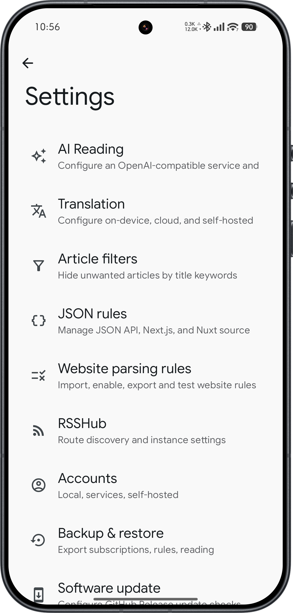
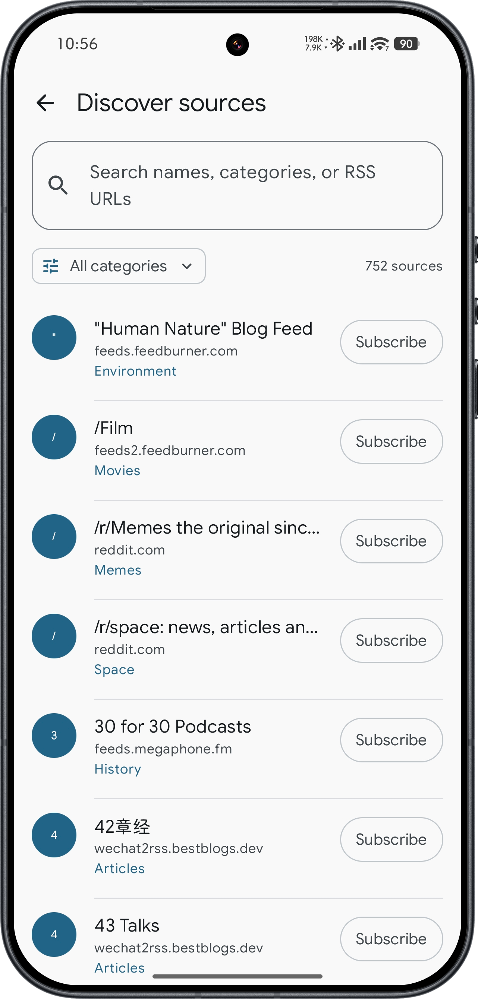
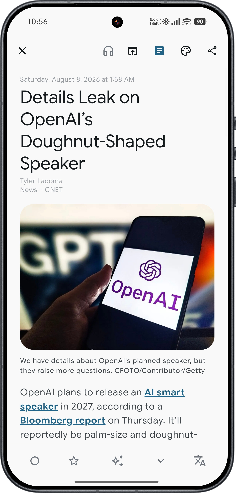
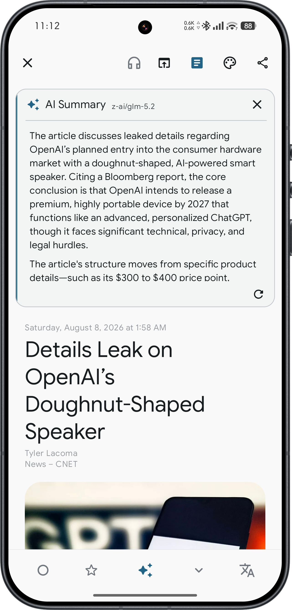
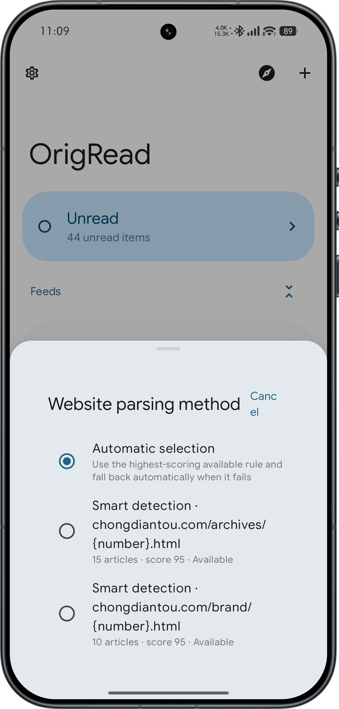
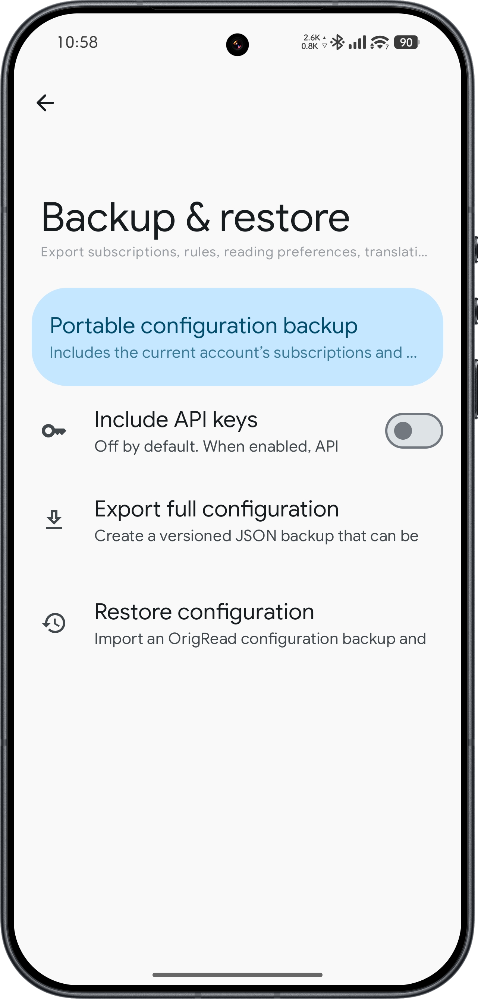

# OrigRead

<div align="center">
  <a href="README.md">English</a> |
  <a href="README-zh-CN.md">简体中文</a>
</div>

<div align="center">
  
</div>

<div align="center">
  <strong>A source-first Android reader for RSS, feeds, news and the wider web.</strong>
</div>

<div align="center">
  RSS / Atom · RSSHub · Website parsing · JSON/API sources · Full-text extraction · Translation · AI summaries · OPML
</div>
<div align="center">
  
  
  <a href="LICENSE"></a>
  
  
  
</div>


## What is OrigRead?

OrigRead is a source-first Android reader for people who want to follow information without turning their reading workflow into an algorithmic recommendation feed.

Beyond traditional RSS / Atom, OrigRead can also work with RSSHub, ordinary webpages, JSON/API sources, WordPress REST, embedded Next.js / Nuxt data, and a restricted WebView fallback when a dynamic page really requires it.

The goal is simple: **subscribe to the source, preserve the original link, extract readable content, filter noise locally, and use translation or AI only when you ask for it.**

## Which edition should I download?

OrigRead now has two Android editions. **Both include the same core subscription, reading, full-text extraction, filtering, translation and AI summary features. OrigRead X adds a more capable AI reading assistant on top.**

| Edition | Best for | APK filename |
| --- | --- | --- |
| **OrigRead** | Best if you mainly want subscriptions, reading, full text, filters, translation and summaries, with fewer advanced AI settings | `OrigRead-vX.Y.Z.apk` |
| **OrigRead X** | Best if you also want article-focused chat, multi-article context, web search, MCP tools, Skills and reusable prompts | `OrigRead-X-vX.Y.Z.apk` |

If you are not sure, **start with OrigRead**. You can install OrigRead X later without uninstalling the standard edition.

The two editions use different Android package names, so they can be installed side by side on the same phone. Shared data and settings can be transferred between them with edition sync, while X-only settings stay with OrigRead X.

> Note: older releases may include only the standard APK because OrigRead X did not exist for that version. Check the actual asset filename on the Release page; renaming a standard APK does not make it an OrigRead X build.

## Why OrigRead?

- **Source-first instead of recommendation-first** — subscriptions stay under your control and articles remain tied to their original source URL.
- **More than RSS** — RSS/Atom, RSSHub, HTML website rules, automatic DOM detection, JSON/API rules, WordPress REST, Next.js/Nuxt embedded data and dynamic-page fallback can all participate in source discovery.
- **Deterministic parsing before AI** — normal source discovery, scoring and full-text extraction do not depend on an LLM.
- **AI is an optional reading tool, not the product itself** — use AI for article summaries, full-article translation and assisted parsing-rule generation without turning the app into a general-purpose chat client. Generated rules are still validated locally and saved only after you confirm them.
- **Local filtering before storage** — global or per-source keyword/regex rules can reject unwanted article titles before they enter the local article database.
- **Readable full text with an escape hatch** — explicit content rules, Readability, structured metadata and WebView fallback are combined with a one-tap “Read original” action.
- **Portable configuration** — subscriptions, groups, parsing rules, filters, RSSHub settings, translation settings and AI settings can be exported and restored across devices.

## Screenshots

<p align="center"></p>


| Source discovery | Reading & full text | AI summary |
| --- | --- | --- |
|  |  |  |

| Translation | Parsing rules | Settings & backup |
| --- | --- | --- |
|  |  |  |

### OrigRead X

| AI reading assistant | Multi-article & answer context |
| --- | --- |
| **Screenshot to add**: open an article in “Ask this article”, keep one real Q&A visible, and include the composer, current model and answer area in the same shot.<br><br>Suggested file: `assets/readme/screenshots/en-US/x-assistant.png` | **Screenshot to add**: attach 1–2 related articles, then open “Context for this answer” so the current article, related articles and Used / truncated / omitted states are visible together when possible.<br><br>Suggested file: `assets/readme/screenshots/en-US/x-context.png` |

| Web Search | X AI settings |
| --- | --- |
| **Screenshot to add**: ask a question that clearly needs current information and capture the search progress or results, preferably with the globe button and result sources visible.<br><br>Suggested file: `assets/readme/screenshots/en-US/x-web-search.png` | **Screenshot to add**: capture the X AI settings page with Web Search, MCP, Skills and Quick Messages entries visible together so the X-specific additions are obvious at a glance.<br><br>Suggested file: `assets/readme/screenshots/en-US/x-ai-settings.png` |

## Documentation and other platforms

| 📖 Android user guide | 🖥️ Desktop edition |
| --- | --- |
| [Open the Android user guide](USER_GUIDE.md). It covers both OrigRead and OrigRead X, with X-only features kept in a separate section that standard-edition users can simply skip. | [Open OrigRead Desktop](https://github.com/ZGMFX01A/OrigRead-Desktop) for Windows, macOS and Linux. |

## Source discovery: one URL, multiple strategies

OrigRead does not assume every website exposes the same kind of feed. When you add a source, it tries several discovery methods and scores the valid results locally.

```text
Input URL
  ↓
Direct RSS / Atom
  ↓
HTML rel=alternate + common feed endpoints
  ↓
RSSHub route matching
  ↓
JSON / API / WordPress / Next.js / Nuxt
  ↓
Website parsing rules
  ↓
Automatic repeated-DOM detection
  ↓
Restricted WebView fallback for dynamic pages
  ↓
Local health checks + candidate scoring
  ↓
Best candidate by default, manual choice when needed
```

### RSS / Atom and built-in source discovery

- Direct RSS and Atom subscription.
- Automatic discovery through `<link rel="alternate">`.
- Common endpoint probing such as `/feed`, `/rss`, `/rss.xml`, `/atom.xml`, `/feed.xml` and `/index.xml`.
- A built-in discovery catalog built from **awesome-rss-feeds** and **BestBlogs**, with 700+ deduplicated feeds and multilingual category browsing.
- OPML import and export for migration between feed readers.

### RSSHub integration without embedding RSSHub itself

OrigRead treats RSSHub as an optional route/result layer rather than embedding the Node.js service into Android.

- 5,000+ generated static and parameterized RSSHub route definitions are bundled for local matching.
- URL path/query parameters can be extracted for supported dynamic routes.
- Multiple RSSHub instances can be configured, enabled, disabled and tested independently.
- Recently successful instances are preferred; failed instances enter a short cooldown.
- If RSSHub is unavailable, OrigRead keeps trying RSS, JSON/API and website-parsing options instead of stopping the add-source flow.
- The app never requires Redis, Puppeteer, browserless or a local RSSHub server.

### Website parsing rules and automatic DOM detection

For sites without a usable feed, OrigRead can turn a chronological article list into a subscribable source.

- Configurable **HTML / CSS Selector website rules** based on Jsoup.
- Multiple rules for the same domain can be evaluated as parsing candidates.
- Automatic repeated-DOM detection can discover article cards when no rule is available.
- Candidate scoring looks at article count, valid titles and links, URL uniqueness, timestamp quality and source confidence.
- Your chosen parser is remembered for that source and reused on later refreshes.
- Website rules support import, export, enable/disable, deletion, testing and in-app Markdown documentation.
- A parsing failure never deletes articles that were already stored.

### JSON/API, WordPress, Next.js and Nuxt

OrigRead also supports structured sources that are not traditional feeds.

- Configurable JSON/API rules with a deliberately restricted JSONPath subset.
- Standard public REST/JSON lists and nested arrays.
- WordPress REST API discovery, including WordPress installed in subdirectories.
- Embedded `__NEXT_DATA__`, `__NUXT_DATA__` and Nuxt data payloads.
- Relative URL handling, timestamps, common date formats, optional author/summary/image fields and HTML entity cleanup.
- JSON/API results use the same health checks and candidate scoring as RSS and website parsing.

### Dynamic pages and WebView fallback

Static parsing remains the first choice. WebView is used only as a fallback when ordinary RSS/JSON/HTML strategies cannot produce a healthy result.

- Restricted same-site navigation.
- No dangerous native JavaScript bridge.
- Time-limited loading, followed by cleanup when parsing finishes.
- Dynamic article-list parsing reuses the same website parser and scorer.
- Dynamic article-body extraction reuses the same full-content pipeline.
- Background bulk prefetch does not launch interactive verification pages.

OrigRead does **not** attempt to bypass login walls, CAPTCHA, paid access or website security controls.

## Full-text reading

OrigRead combines several extraction strategies instead of relying on a single parser:

- Explicit website `contentSelectors` when a rule knows the article structure.
- Readability-style general article extraction.
- JSON-LD and OpenGraph metadata for title, author, publication time and fallback content.
- HTML cleanup, unsafe-node removal and relative URL completion.
- Local quality scoring between competing content candidates.
- Restricted WebView fallback for JavaScript-rendered article bodies.
- Clear failure reasons and a one-tap **Read original** fallback.

## Reading experience

- Read / unread state.
- Starred articles.
- Archive and retention controls.
- Feed groups and article search.
- Full-content mode and original-page access.
- Text-to-speech support.
- Material You / Jetpack Compose interface.
- Local account mode plus optional third-party synchronization modes.

## Local article filters

Noise filtering happens before new articles are saved.

- Global title keyword filters.
- Per-source title filters.
- Regular-expression rules with validation before activation.
- Rule enable/disable and deletion.
- Import/export as a standalone JSON rule set.
- Cumulative filtered-article statistics.

Creating a new filter does not delete articles that are already in your library, so a bad rule cannot wipe out existing content.

## Translation: traditional providers and AI

Translation is independent from AI summaries. You can use conventional translation providers without configuring any LLM.

### Traditional translation providers

- Google ML Kit on-device translation.
- Microsoft Translator.
- DeepL.
- Google Cloud Translation.
- Self-hosted DeepLX / DLX-compatible endpoints.

The reader supports title/body translation, translated-only display, bilingual paragraph display, content-hash caching, provider selection and long-article batching.

## Share articles to note apps

On an article page, **Share** can send more than a link. The original article URL is always included. The first time you use it, choose what to include: the title, original body, the translation currently open in the reader, and/or the summary currently open in the reader. After that, tapping Share uses your saved choices; press and hold Share whenever you want to change them.

OrigRead sends rich HTML when the receiving app supports it, with styled-text and plain-text fallbacks otherwise. Images stay as external links instead of being copied as files. A cached translation or summary is shared only when it is currently open in the reader. Sharing directly from the article list is unchanged.

### AI full-article translation

OpenAI-compatible models can also be selected as translation targets.

- Multiple AI providers and models.
- Strict translation prompt: no summarizing, explaining, expanding or changing the author’s position.
- Long articles are split into smaller batches that fit the request limits.
- Stable block IDs are validated so model output cannot silently reorder or merge document sections.
- OrigRead rebuilds the HTML locally so the model cannot silently rewrite the page structure.

## AI reading features

AI is optional and only runs when configured and invoked by the user.

### Multiple OpenAI-compatible providers

Each provider has its own settings:

- Display name.
- Base URL or complete Chat Completions endpoint.
- Optional API key.
- Models discovered from the service or added manually.
- Default model.
- Enable/disable switch and connection test.

This works with many OpenAI-compatible cloud services, self-hosted gateways and local model servers without coupling OrigRead to a single vendor.

### AI article summaries

- Brief, standard and detailed summary levels.
- Markdown rendering inside the reader.
- Content-hash-based caching.
- Visible generation stages and elapsed time so the app does not look frozen during a non-streaming request.
- Regenerate with a different provider, model or summary level without changing your global defaults.
- The summary opens alongside the article instead of taking over the reading screen.

### AI-assisted parsing-rule generation

AI-assisted WebsiteRule/JsonRule generation uses a review-before-save workflow. OrigRead fetches the target page, lets you choose a configured provider and model, asks the model for a candidate rule, then runs the normal local parser and health checks. Nothing is saved until you confirm it. The app also shows the parsed-article count, score, model and repair attempts. Generated rules still depend on the target site's structure, so they should be retested after a site redesign.

## OrigRead X: keep AI next to the article

OrigRead X includes everything in the standard edition, then adds tools for when you want to **keep working with an article after reading or summarizing it**.

- **Ask questions about the current article** — open the AI reading assistant directly from the reader, with the current article already in context.
- **Ask about selected text** — select a sentence or paragraph and send that exact selection into the assistant.
- **Attach several articles** — add related articles when comparing reports or bringing in background. Only the articles you explicitly select are sent as context.
- **Web Search** — automatically or manually search the web when a question needs current information, while keeping the search activity and results visible.
- **MCP tools** — connect MCP Servers you configure yourself. Sensitive or write-capable tools require explicit approval before execution.
- **Skills, Quick Messages and Custom Instructions** — save reusable analysis methods, common questions and long-term response preferences.
- **Streaming, reasoning controls and Context Budget** — additional controls for advanced models and long-context reading; the defaults are fine for normal use.

None of these extensions is required just to use OrigRead X. **You can install X and keep using the normal reading, translation and summary features without configuring Web Search, MCP or Skills.**

For step-by-step instructions, see [Part II: OrigRead X in the Android user guide](USER_GUIDE.md#origread-x-guide).

## Configuration backup and restore

OrigRead provides a versioned JSON configuration backup instead of copying the raw database.

The backup can include:

- Subscriptions and groups for the current account.
- Synchronization preferences.
- Website rules and JSON/API rules.
- Article filters.
- The preferred website parser for each source.
- RSSHub instances, settings and source mappings.
- Translation providers and settings.
- AI providers, model lists and defaults.
- General user preferences, including update-check preference.

When restoring, OrigRead matches subscriptions by URL: existing subscriptions are reused, missing ones are added, and subscriptions that already exist only on the target device are left alone.

API keys are **excluded by default**. If you explicitly include secrets, a backup password is required and the secret block is encrypted with PBKDF2-HMAC-SHA256 key derivation and AES-256-GCM so it can be restored on another device without reusing device-bound Android Keystore ciphertext.

Article bodies, read/star states, generated summaries, translation caches and temporary update state are not part of portable configuration backups.

## Software updates

The GitHub build supports in-app update checking and APK installation through GitHub Releases.

- Optional “check for updates on app start” setting.
- Manual “check now” action.
- Release notes and automatic selection of the matching APK for OrigRead or OrigRead X.
- Download progress, retry and install flow.
- Android 8+ installation permission is handled through the normal system settings page.

## Security and privacy design

- Normal RSS/website parsing and candidate scoring are local and deterministic.
- AI services are optional; article content is sent only when the user invokes an AI feature.
- Cloud translation services are optional; ML Kit can provide on-device translation for supported languages.
- Cloud API keys are stored with Android Keystore-backed encryption.
- Configuration backups exclude API keys unless the user explicitly opts in and supplies a backup password.
- WebView parsing does not expose a privileged JavaScript-to-Android bridge.
- OrigRead does not bypass authentication, CAPTCHA, paywalls or access controls.

## Installation

Download the APK you want from [GitHub Releases](https://github.com/ZGMFX01A/OrigRead/releases):

- Standard OrigRead: `OrigRead-vX.Y.Z.apk`.
- OrigRead X: `OrigRead-X-vX.Y.Z.apk`.

If an older release contains only `OrigRead-vX.Y.Z.apk`, OrigRead X simply was not published for that version.

If you are unsure, install the standard edition first. You can install X beside it later and use edition sync to move shared data.

Current GitHub release builds target:

- Android 8.0 / API 26 or later.
- `arm64-v8a` devices.

## Build from source

Requirements:

- Android Studio with the required Android SDK.
- JDK 17.

Windows:

```powershell
.\gradlew.bat assembleGithubRelease
```

Linux / macOS:

```bash
./gradlew assembleGithubRelease
```

In-app GitHub updates are included only in the GitHub build. F-Droid and Google Play builds use their own store-appropriate update paths.

## Project origin and license

OrigRead is a derivative project based on [Read You](https://github.com/ReadYouApp/ReadYou).

Read You provided the original application foundation, including much of the Compose UI, RSS reader architecture, localization framework and core reading experience. OrigRead builds on that foundation with multi-source discovery, parsing rules, JSON/API sources, RSSHub integration, dynamic-page fallback, full-text extraction, filters, translation and AI features, configuration backup and GitHub-based updates.

Thanks to the Read You maintainers and contributors for their open-source work.

OrigRead is distributed under the **GNU General Public License v3.0 (GPL-3.0)**. See [`LICENSE`](LICENSE).

## Links

- Repository: https://github.com/ZGMFX01A/OrigRead
- Releases: https://github.com/ZGMFX01A/OrigRead/releases
- Issues: https://github.com/ZGMFX01A/OrigRead/issues
- Desktop edition: https://github.com/ZGMFX01A/OrigRead-Desktop
- User guide: [English](USER_GUIDE.md) · [简体中文](USER_GUIDE-zh-CN.md)
- Upstream Read You: https://github.com/ReadYouApp/ReadYou

## Search keywords

Android RSS reader, RSS reader, Atom reader, feed reader, Android feed reader, news reader, personal information reader, RSSHub client, RSSHub Android, RSS discovery, RSS source discovery, OPML reader, full-text RSS, full content extraction, Readability, website parser, website feed parser, HTML parser, CSS selector parser, JSON API reader, JSONPath, WordPress REST reader, Next.js feed, Nuxt feed, WebView parser, article filter, regex filter, AI summary, article summarizer, AI translation, OpenAI compatible, DeepL, DeepLX, Google ML Kit translation, Material You, Jetpack Compose, Kotlin.

## Star History

[](https://www.star-history.com/?repos=ZGMFX01A%2FOrigRead&type=timeline&logscale=&legend=top-left)
