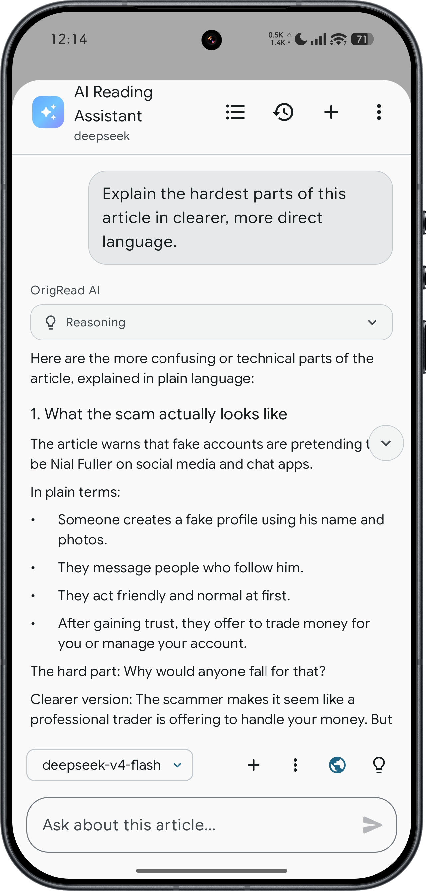
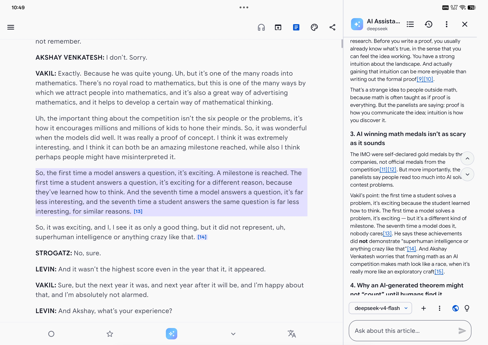
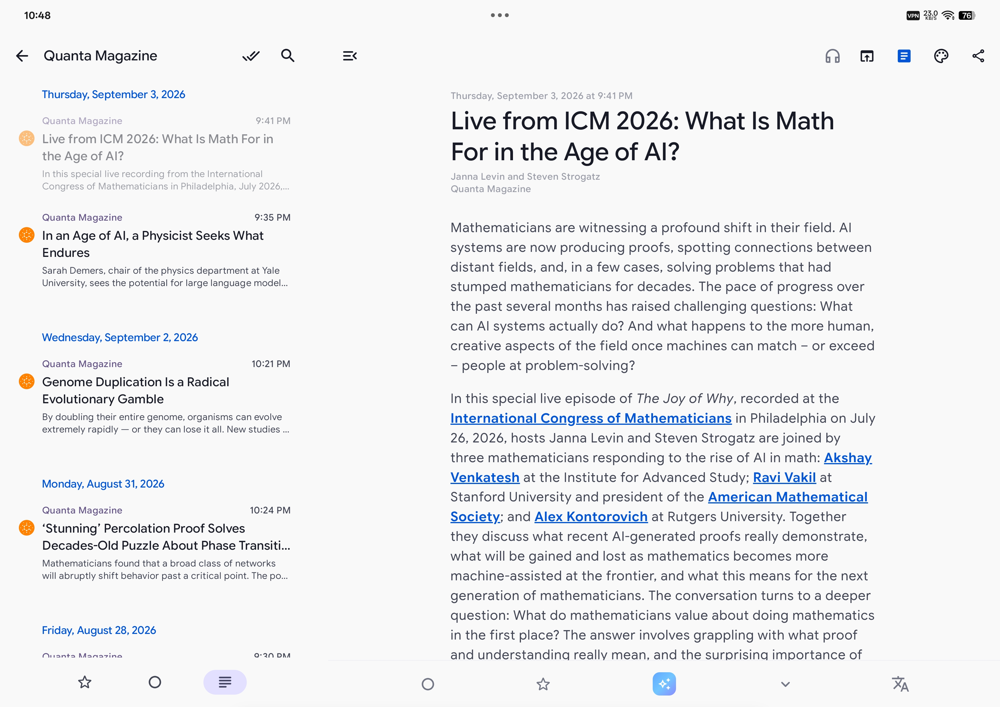
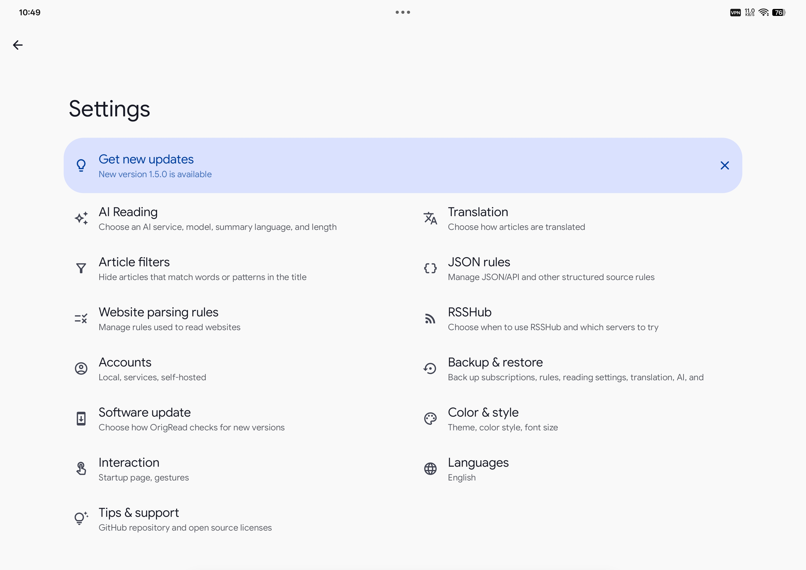

<div align="center">
  
  <h1>OrigRead · 原读</h1>
  <p><strong>Read what matters to you. Stay close to the source.</strong></p>
  <p>An Android RSS reader that brings your feeds, full articles, and AI reading tools together.</p>
  <p>English · <a href="README-zh-CN.md">简体中文</a></p>
  <p>
    <a href="https://github.com/ZGMFX01A/OrigRead/releases/latest"></a>
    
    <a href="LICENSE"></a>
    
    <a href="https://github.com/ZGMFX01A/OrigRead/stargazers"></a>
  </p>
  <p>
    <a href="https://github.com/ZGMFX01A/OrigRead/releases/latest"><strong>Download for Android</strong></a> ·
    <a href="USER_GUIDE.md">User guide</a> ·
    <a href="https://github.com/ZGMFX01A/OrigRead-Desktop">Desktop app</a> ·
    <a href="https://github.com/ZGMFX01A/OrigRead/issues">Report an issue</a>
  </p>
</div>

## A home for the things you want to read

Your favorite blogs, the news you follow, that occasional column worth waiting for—all in one place. OrigRead brings your chosen sources into a timeline you can read at your own pace.

Start with a website, open an article, and read the full text. Keep a translation alongside an unfamiliar language, or ask AI about a passage you want to understand. When you want to check an answer, follow its citation back to the text it draws on. **The original stays within reach, from the first headline to the next question.**

<table>
  <tr>
    <th width="33%">Find your sources</th>
    <th width="33%">Settle into an article</th>
    <th width="33%">Follow your questions</th>
  </tr>
  <tr>
    <td align="center"></td>
    <td align="center"></td>
    <td align="center"></td>
  </tr>
</table>

## Citation: follow an answer back to its source

An AI answer can leave you with another question: did the author really say that? What was the context? Do these two reports rely on the same evidence? Citation connects answers to the passages they draw on, so you can check as you read.

**From the answer to the article.** Answers that cite articles include markers such as `[1]` and `[2]`. Follow an article citation to locate and highlight the relevant text, with its surrounding context intact. If the evidence comes from another attached article, OrigRead can take you there too. When a marker refers to several sources, you can open it and choose which one to check.

**From the article back to the answer.** Citation markers in the article work in the other direction. They return you to the conversation and answer that cited the passage, and to the relevant paragraph within that answer. This also works after following a citation into a different article, so you can pick up where you left off.

For example, attach two reports about the same event and ask, “Where do their accounts differ?” Follow the citations to read each author's words, then return to the comparison and ask a follow-up. **AI helps organize the evidence; citations let you judge it for yourself.**

Web search citations retain their web sources, and tool results retain theirs. If an article has changed and an old citation can no longer be located precisely, OrigRead offers the source for you to inspect. A citation makes an answer easier to check; it does not guarantee that AI has interpreted it correctly.

See the [Citation chapter](USER_GUIDE.md#6-citation-the-reference-can-take-you-back-to-the-evidence) for a walkthrough.

## From finding an article to understanding it

### Follow sites beyond RSS

A favorite site without a subscribe button does not always need another daily browser visit. **OrigRead can turn regularly updated website content into a source you can follow.** Paste a home or section URL to look for RSS / Atom feeds and matching RSSHub routes. When there is no ready-made feed, OrigRead can also look for articles in web page lists and public JSON/API data. This includes WordPress article APIs and article data embedded in some Next.js and Nuxt pages.

You do not have to choose a parsing method upfront. OrigRead checks article counts, titles, links, and dates to rank the available results. Preview the candidates and choose the section you actually want to follow. Your chosen method is saved with the source for later refreshes. For dynamic pages whose content appears only after loading, browser rendering offers another way to try.

For sites that need special handling, parsing rules tell OrigRead where to find article lists and full text. Import or export rules, or ask AI to help create one, then **inspect the articles it actually finds before saving**. Everyday discovery and parsing need no AI setup. Reliable updates still depend on the site's access conditions and structure; a redesign may require a rule update.

Browse the built-in source directory for something new, or import OPML to bring your existing subscriptions. See the [user guide](USER_GUIDE.md#2-add-sources-give-origread-the-url) for adding sources, choosing results, and resolving parsing problems.

### Read comfortably, keep what matters

When a feed offers only a short excerpt, try fetching the full article. Open the original page whenever you want its charts, comments, or other details. A Material You interface and adjustable reading appearance help make longer pieces comfortable to read.

Read foreign-language articles with paragraph-by-paragraph translations, using an on-device, cloud, or AI translation service. Switch to TTS when you would rather listen. To save something in your notes, share the article along with any translation or summary currently open in the reader, keeping the original link attached.

Organize sources into groups, star articles worth returning to, and use keyword or regular-expression filters to keep unwanted new articles out of your reading list.

### Let AI follow your reading

Start a long article with a summary, ask a question about it, or select a passage to discuss. Attach related articles when you want to compare perspectives. Use web search when you need more background or recent developments.

OrigRead supports OpenAI-compatible services, so you can choose a cloud provider, a self-hosted service, or a local model service. Save recurring questions as quick messages, keep reusable approaches in Skills, and set response preferences with custom instructions. MCP support lets you connect additional tools when you need them.

All of this is optional. Feeds and everyday reading work without AI configuration. Start reading, and add the tools that become useful to you.

## More room to read on a tablet

A larger screen keeps more context in view: browse the article list with the reader still open, or put AI beside the article. Read an answer, glance at the original, and continue your thought.



<table>
  <tr><th width="50%">Home</th><th width="50%">Settings</th></tr>
  <tr>
    <td align="center"></td>
    <td align="center"></td>
  </tr>
</table>


## Download and get started

Get the APK from [GitHub Releases](https://github.com/ZGMFX01A/OrigRead/releases/latest). It supports **ARM64 devices running Android 8.0 or later**. Add a source or import an OPML file to start reading. You can check for future updates in the app.

OrigRead and OrigRead X have **the same features, with slightly different defaults**. Both packages remain available so existing users can keep their app and settings, and update without reinstalling or migrating.

| Package | Which to download |
| --- | --- |
| `OrigRead-vX.Y.Z.apk` | Start here if you are new, or keep updating this package if you already use OrigRead. |
| `OrigRead-X-vX.Y.Z.apk` | Keep using this package if you already use OrigRead X. |

The apps can coexist and support edition sync. See the [Android user guide](USER_GUIDE.md) for setup and everyday use. For Windows, macOS, and Linux, visit [OrigRead Desktop](https://github.com/ZGMFX01A/OrigRead-Desktop).

## Your subscriptions, in your hands

Use a local account or connect a supported third-party sync service. Routine source parsing, full-text extraction, and filtering run on your device. Using AI or cloud translation sends the relevant content to the service you configure. On-device translation is also available for supported languages.

Configuration backups help carry your subscriptions, groups, parsing rules, and translation and AI settings to another device. API keys are excluded by default; you can include them in a password-encrypted export if needed. **Configuration backups do not include article bodies or read and starred states.** The [user guide](USER_GUIDE.md#12-backup-edition-sync-and-accounts) explains what backups and account sync each cover.

## Feedback and discussion

Found a problem or have an idea? [Open an issue](https://github.com/ZGMFX01A/OrigRead/issues). For a source that fails to subscribe or an incomplete article, include the URL, app version, and steps to reproduce it. please use issues for feature suggestions, translation corrections, and documentation feedback too.

<details>
<summary>Build from source</summary>

Use JDK 17, open the project in Android Studio, and install the required Android SDK. Build both GitHub packages with:

Windows:

```powershell
.\gradlew.bat assembleStandardGithubRelease assembleLlmGithubRelease
```

Linux / macOS:

```bash
./gradlew assembleStandardGithubRelease assembleLlmGithubRelease
```

Release builds require local signing configuration. See [app/build.gradle.kts](app/build.gradle.kts) for the expected setup.

</details>

## Credits and license

OrigRead is based on [Read You](https://github.com/ReadYouApp/ReadYou), building on its reader foundation, Compose interface, and localization work. Thank you to its authors and contributors, and to everyone who helps OrigRead through feedback, translations, and code.

OrigRead is distributed under the **GNU Affero General Public License v3.0 (AGPL-3.0-only)**. See [LICENSE](LICENSE). Code inherited from Read You and other third-party components retains its applicable original license notices.

<details>
<summary>Star history</summary>

[](https://www.star-history.com/#ZGMFX01A/OrigRead&Date)

</details>
